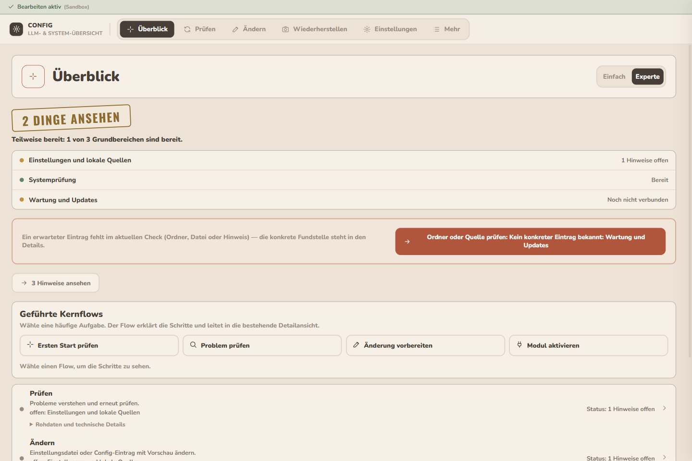
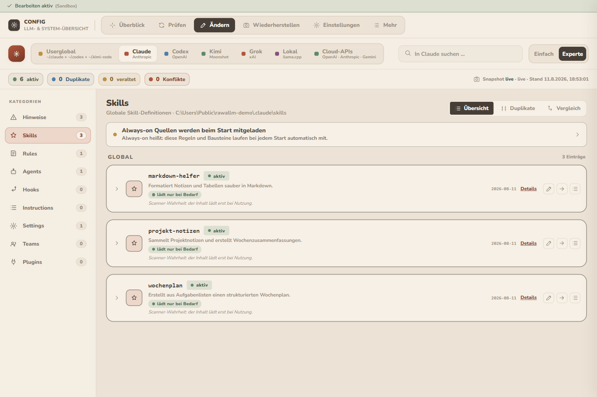
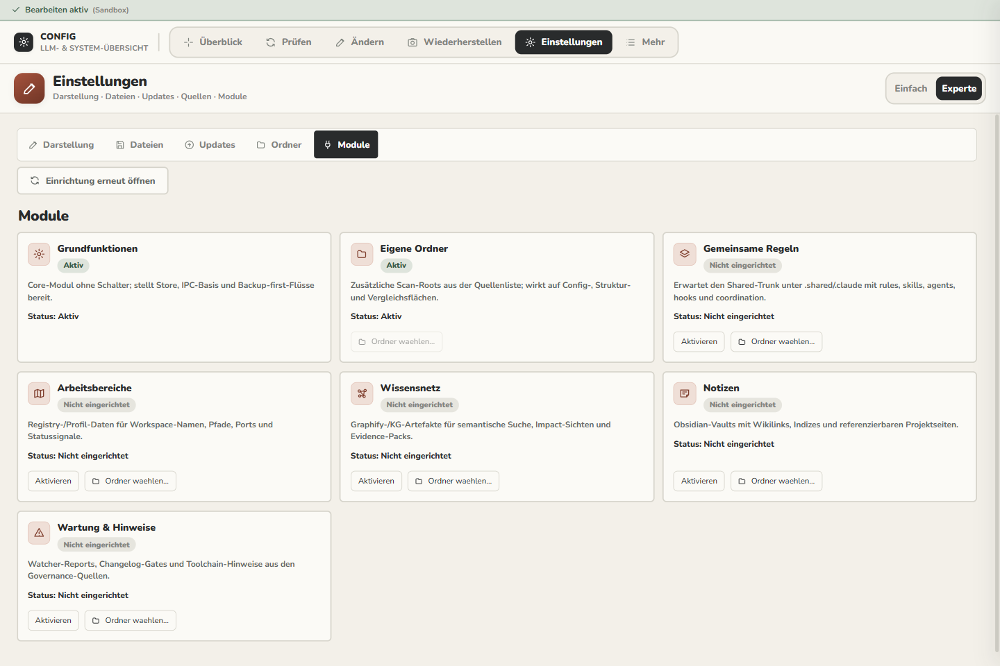
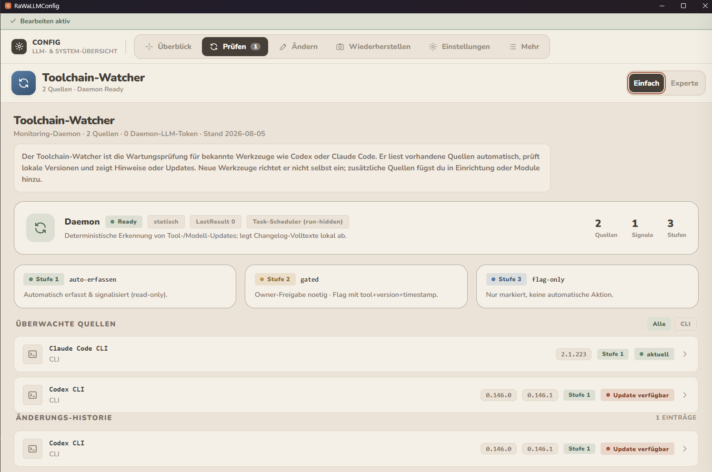

# RaWaLLMConfig

## Aktueller Status / Current status

**Hinweis: Diese Alpha wird durch einen Neubau ersetzt**

Die hier veröffentlichte Version 0.1.12 gehört zur bisherigen RaWaLLMConfig-App. Für diesen Altstand bestehen offene Sicherheitswarnungen in verwendeten Abhängigkeiten. Wir empfehlen deshalb, diese Version vorerst nicht neu zu installieren oder einzusetzen.

RaWaLLMConfig wird derzeit als eigenständige App neu entwickelt. Der Neubau ist noch nicht zur Nutzung freigegeben; einen Veröffentlichungstermin gibt es noch nicht.

Quellcode und bisherige Releases bleiben zur Nachvollziehbarkeit erhalten.

**Notice: This alpha is being replaced**

Version 0.1.12 belongs to the previous RaWaLLMConfig app. Dependencies used by this version have unresolved security alerts. We therefore recommend against installing or using it for now.

RaWaLLMConfig is being rebuilt as a standalone app. The replacement is not yet available for use, and no release date has been announced.

Source code and previous releases remain available for reference.

RaWaLLMConfig is a local desktop app for inspecting and safely managing AI
tool configuration. Deutsche Informationen stehen zuerst; an English summary
follows below.

## Bildschirmfotos

Aufgenommen aus dem Build der Version 0.1.12.









## Deutsch

RaWaLLMConfig macht lokale Konfigurationen für Claude, Codex, Kimi, Grok,
MCP, Hooks, Agenten und lokale Modelle an einem Ort sichtbar. Die App
arbeitet lokal. Schreibaktionen brauchen eine Bestätigung und legen zuerst
eine Sicherung an.

Die folgenden Abschnitte dokumentieren die bisherige öffentliche Alpha.
Für die aktuelle Nutzungsempfehlung gilt der Statushinweis oben.

### Enthaltene Funktionen

- Übersicht über erkannte Konfigurationsquellen und wichtige Zustände.
- Geführte Einstiege für Prüfung, Vergleich und sichere Änderungen.
- Geschützter Schreibmodus mit Bestätigung und Backup-first-Logik.
- Fortschrittsanzeige bei längeren Speichervorgängen (Sicherung anlegen,
  Dateien verschieben, Verweise aktualisieren, Prüfen).
- Trennung von echten Duplikaten und gewollten Kopien: als Paritäts-Kopie
  festgelegte oder ignorierte Paare verlassen die Duplikatliste.
- Toolchain-Watcher für lokale Versionen und Wartungshinweise.
- Plattformbezogene Auswahl passender Update-Pakete.
- Node-basierte Service-Tests für zentrale App-Flows.

### Bisherige Downloads und Updates

Die [bisherigen Releases][releases] bleiben als historische Artefakte erhalten.
Die frühere Downloadempfehlung ist zurückgenommen. Wir empfehlen vorerst
weder die Installation noch den Einsatz der alten Alpha. Dies gilt für alle
Betriebssysteme; ein früherer Build- oder Paketnachweis ist keine aktuelle
Sicherheitsfreigabe.

### Toolchain-Watcher

Claude Code, Codex, MCPs und lokale Modelle ändern sich regelmäßig. Der
Watcher verbindet lokal erfasste Versions- und Changelog-Hinweise mit der
vorhandenen Konfiguration. Er zeigt Hinweise an, führt aber keine stillen
Installationen oder Reparaturen aus.

Für Claude Code gilt der native Standalone-Pfad als Projektvorgabe; npm gehört
nicht zum unterstützten Betriebsweg. Der Versionscheck über `claude --version`
bestätigt nur die erreichbare Version; er weist weder den Installationspfad
noch den Installationsursprung nach.

### Noch nicht vollständig

- Import eigener Sprachdateien.
- Vollständige Vorlagenverwaltung.
- Einfach-/Expertenmodus in jeder Ansicht.
- Datenbank-Unterstützung als Standardpfad für normale Nutzer.
- Vollständige Linux-CI mit Paket- und Startbeweis.

### Entwicklung und Prüfung

Voraussetzung ist Node.js 22 oder neuer mit Corepack.

```bash
corepack pnpm install --frozen-lockfile
corepack pnpm typecheck
corepack pnpm test
corepack pnpm build
```

### Build-Matrix

- `corepack pnpm dist:win` baut den Windows-NSIS-Installer.
- `corepack pnpm dist:linux` baut AppImage, deb und rpm.
- `corepack pnpm dist:all` startet beide konfigurierten Build-Ziele.

Für Release-Beweise sollen Windows- und Linux-Pakete auf dem jeweiligen
nativen Betriebssystem oder in einer entsprechenden CI-Matrix gebaut und
gestartet werden. Ein erfolgreicher Quell-Build ersetzt diesen Paketbeweis
nicht.

### Öffentlicher Quell-Export

Der öffentliche Quellstand wird aus einem frischen, leeren Ziel außerhalb des
Repositories erzeugt und anschließend geprüft:

```bash
corepack pnpm release:notices
corepack pnpm release:export "../rawallmconfig-public-alpha"
corepack pnpm release:verify "../rawallmconfig-public-alpha"
```

Der Exportumfang steht in
[`docs/PUBLIC-RELEASE-SCOPE.md`](docs/PUBLIC-RELEASE-SCOPE.md).

### Lizenz und Beiträge

Der Quellcode steht unter AGPL-3.0-or-later. Externe Beiträge benötigen vor
dem Merge eine Contributor License Agreement. Details stehen in
[`CONTRIBUTING.md`](CONTRIBUTING.md).

## English

RaWaLLMConfig brings local configuration for Claude, Codex, Kimi, Grok, MCP,
hooks, agents, and local models into one desktop app. It runs locally. Write
actions require confirmation and create a backup before changing files.

The following sections document the previous public alpha.
For current usage guidance, see the status notice above.

### Included features

- An overview of detected configuration sources and important states.
- Guided entry points for inspection, comparison, and safe changes.
- Protected write mode with confirmation and backup-first safeguards.
- Progress display for longer write operations (snapshot, move files,
  update references, verify).
- Separation of real duplicates from intended copies: pairs declared as
  parity copies or ignored leave the duplicate list.
- A toolchain watcher for local versions and maintenance notices.
- Platform-aware selection of matching update packages.
- Node-based service tests for central app flows.

### Previous downloads and updates

[Previous releases][releases] remain available as historical artifacts.
The previous download recommendation has been withdrawn. We recommend
against installing or using the old alpha for now. This applies to every
operating system; previous build or package verification is not current
security approval.

### Toolchain watcher

Claude Code, Codex, MCPs, and local models change regularly. The watcher
connects locally collected version and changelog notices with the detected
configuration. It shows notices but does not perform silent installations or
repairs.

For Claude Code, the native standalone path is the project standard; npm is
outside the supported operating path. The `claude --version` check confirms
only the reachable version; it proves neither the installation path nor its
origin.

### Not yet complete

- Importing custom language files.
- Complete template management.
- Simple/Expert mode in every view.
- Database support as the default path for regular users.
- Complete Linux CI with package and launch evidence.

### Development and verification

Node.js 22 or newer with Corepack is required.

```bash
corepack pnpm install --frozen-lockfile
corepack pnpm typecheck
corepack pnpm test
corepack pnpm build
```

### Build matrix

- `corepack pnpm dist:win` builds the Windows NSIS installer.
- `corepack pnpm dist:linux` builds AppImage, deb, and rpm packages.
- `corepack pnpm dist:all` starts both configured build targets.

For release evidence, Windows and Linux packages should be built and launched
on the matching native operating system or CI matrix. A successful source
build does not replace package-level evidence.

### Public source export

The public source set is created in a fresh, empty target outside the
repository and verified afterwards:

```bash
corepack pnpm release:notices
corepack pnpm release:export "../rawallmconfig-public-alpha"
corepack pnpm release:verify "../rawallmconfig-public-alpha"
```

The export scope is documented in
[`docs/PUBLIC-RELEASE-SCOPE.md`](docs/PUBLIC-RELEASE-SCOPE.md).

### License and contributions

The source code is licensed under AGPL-3.0-or-later. External contributions
require a Contributor License Agreement before merge. See
[`CONTRIBUTING.md`](CONTRIBUTING.md) for details.

[releases]: https://github.com/RaWa-KI/RaWaLLMConfig/releases/latest
